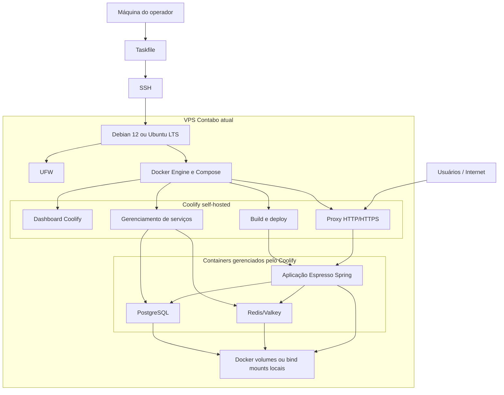
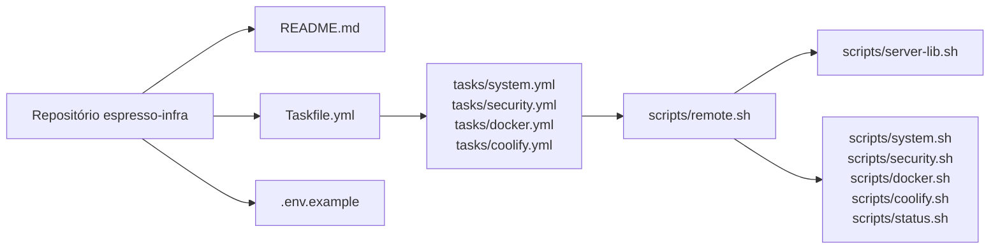
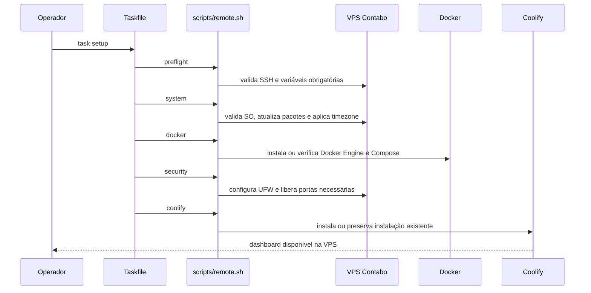
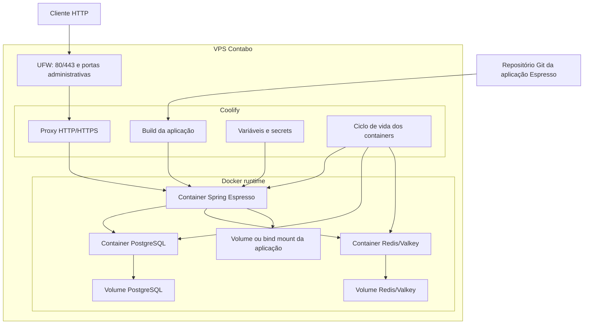
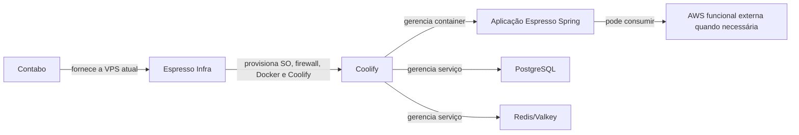

# Arquitetura

Este documento descreve a arquitetura do Espresso Infra e do ambiente provisionado para o projeto Espresso: componentes do repositório, fluxo de provisionamento, VPS, Coolify, containers da aplicação Spring, PostgreSQL, Redis/Valkey e persistência.

## Visão geral

## Componentes do repositório

## Fluxo de provisionamento

## Runtime do software

## Limites arquiteturais

O Espresso Infra provisiona a base de infraestrutura na VPS: sistema operacional suportado, firewall, Docker e Coolify. A VPS atual é da Contabo, mas o repositório assume que ela já existe e está acessível por SSH. O ciclo de vida da aplicação Spring, do PostgreSQL, do Redis/Valkey, dos domínios, certificados e variáveis é gerenciado pelo Coolify. Integrações externas funcionais, como S3, permanecem dependências da aplicação quando existirem.
