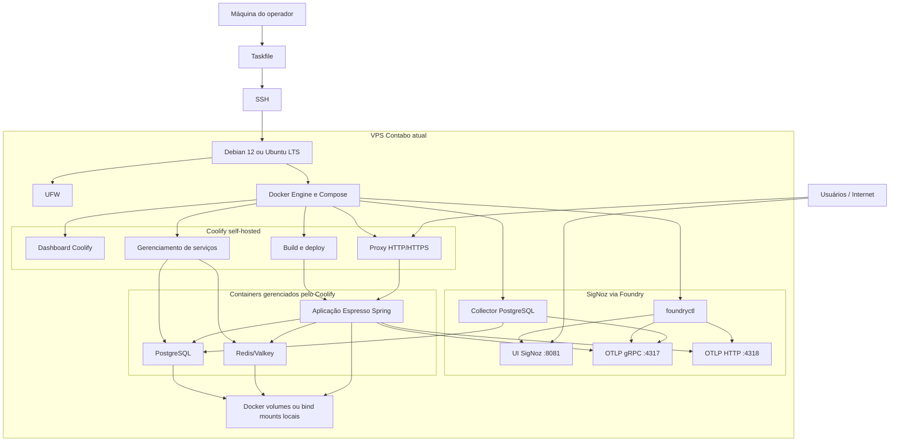
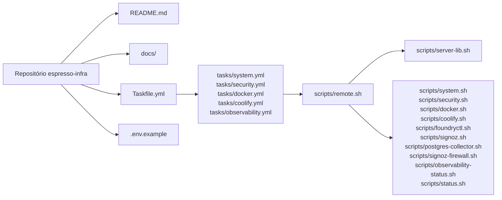
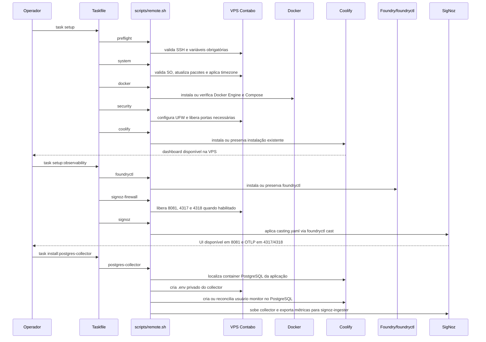
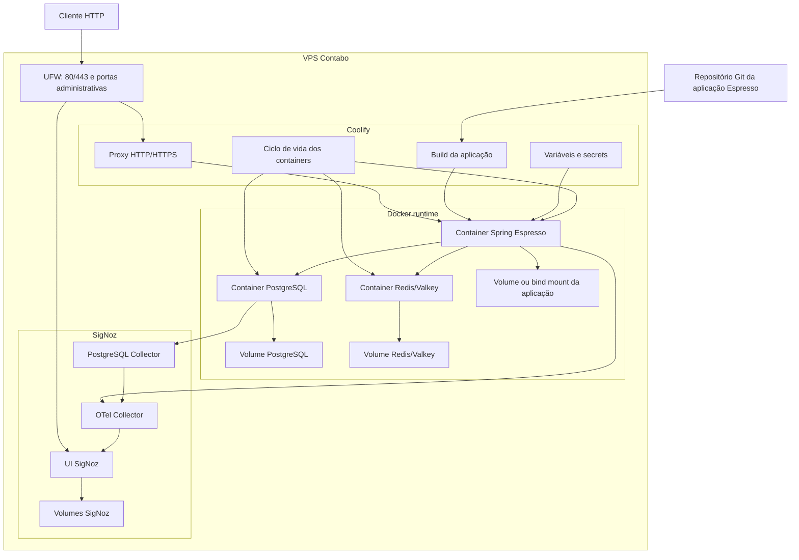
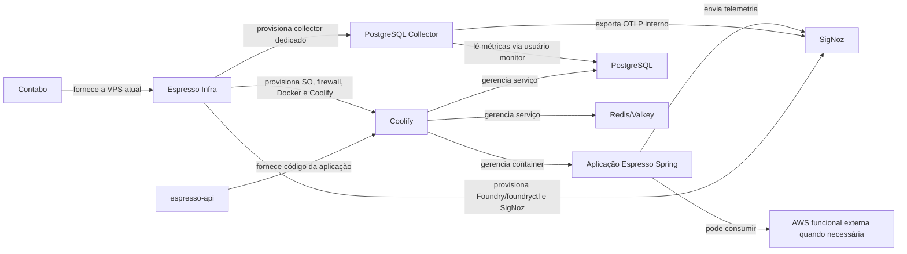

# Arquitetura

Este documento descreve a arquitetura do Espresso Infra e do ambiente provisionado para o projeto Espresso: componentes do repositório, fluxo de provisionamento, VPS, Coolify, containers da aplicação Spring, PostgreSQL, Redis/Valkey, SigNoz e persistência.

Voltar para o [README](../README.md). Consulte também [Aplicação Espresso API](application.md), [Coolify](coolify.md), [SigNoz](signoz.md), [Collector PostgreSQL](postgres-collector.md) e [Operação](operations.md).

## Visão geral

## Componentes do repositório

## Fluxo de provisionamento

## Runtime do software

## Limites arquiteturais

O Espresso Infra provisiona a base de infraestrutura na VPS: sistema operacional suportado, firewall, Docker, Coolify e observabilidade SigNoz quando o fluxo opt-in é executado. A VPS atual é da Contabo, mas o repositório assume que ela já existe e está acessível por SSH.

O ciclo de vida da aplicação Spring, do PostgreSQL, do Redis/Valkey, dos domínios, certificados e variáveis é gerenciado pelo Coolify. SigNoz é gerenciado separadamente pelo Foundry/foundryctl. O collector PostgreSQL é uma integração de observabilidade separada: ele usa um `.env` privado na VPS para criar ou reconciliar um usuário monitor no container PostgreSQL do Coolify e exporta métricas ao SigNoz pela rede Docker interna.

Integrações externas funcionais, como S3, permanecem dependências da aplicação quando existirem.

O fluxo completo do collector PostgreSQL está descrito em [Collector PostgreSQL](postgres-collector.md).
