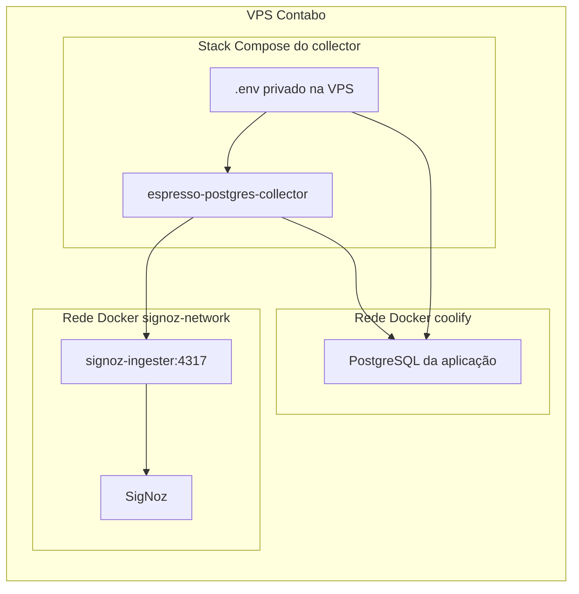
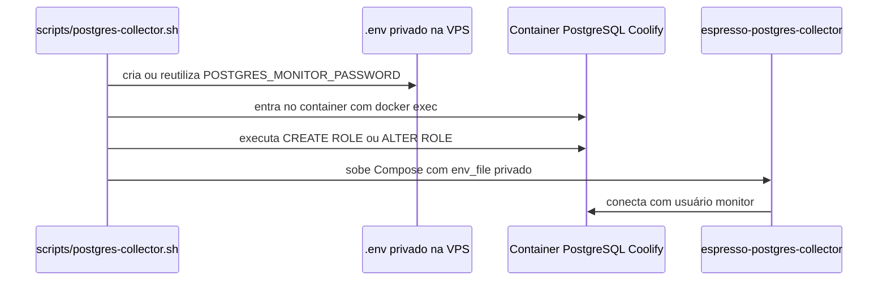

# Collector PostgreSQL

Este documento descreve somente o fluxo de coleta de métricas do PostgreSQL da aplicação Espresso para o SigNoz. A arquitetura geral do repositório fica em [Arquitetura](architecture.md).

Voltar para o [README](../README.md). Consulte também [SigNoz](signoz.md), [Coolify](coolify.md), [Aplicação Espresso API](application.md) e [Operação](operations.md).

## Objetivo

O collector PostgreSQL coleta métricas básicas do banco da aplicação, gerenciado pelo Coolify, e envia esses dados ao SigNoz por OTLP interno. Ele é uma integração operacional separada: não é sidecar do Postgres, não pertence ao Compose do Coolify e não altera o collector interno gerado pelo Foundry para o SigNoz.

## Topologia



O container do collector é conectado a duas redes externas:

- `coolify`, para alcançar o PostgreSQL da aplicação sem publicar `5432` no host;
- `signoz-network`, para exportar métricas ao `signoz-ingester:4317`.

## Credencial

A senha do usuário monitor nasce no host da VPS, dentro do diretório operacional privado:

```text
/data/signoz-integrations/postgres-collector/.env
```

Esse arquivo é criado pelo script remoto e deve ter permissão restrita. Ele contém a senha usada pelo collector e também é a fonte usada para reconciliar o usuário dentro do PostgreSQL.

Fluxo da credencial:



O `.env` privado não é copiado para o repositório. O script não deve imprimir a senha, tokens ou strings de conexão completas.

## Deploy

O deploy é acionado por:

```bash
task install:postgres-collector
```

A task executa `scripts/remote.sh postgres-collector`, que envia `scripts/postgres-collector.sh` para execução na VPS. O script:

1. valida Docker, Compose e as redes `coolify` e `signoz-network`;
2. localiza o container PostgreSQL da aplicação por label do Coolify ou usa `POSTGRES_COLLECTOR_POSTGRES_CONTAINER`;
3. cria ou reutiliza o `.env` privado do collector;
4. entra no container PostgreSQL do Coolify e cria ou reconcilia o usuário monitor com a senha do `.env`;
5. gera `collector.yaml` e `docker-compose.yml`;
6. executa `docker compose up -d` para subir ou atualizar o collector.

Arquivos operacionais esperados na VPS:

```text
/data/signoz-integrations/postgres-collector/
  .env
  collector.yaml
  docker-compose.yml
```

## Coleta

A primeira versão usa o receiver PostgreSQL do OpenTelemetry Collector para métricas básicas. O collector exporta para o SigNoz por OTLP gRPC interno:

```text
postgresql receiver -> batch/resource processors -> otlp/signoz exporter
```

Query samples, top queries, planos de query e habilitação automática de `pg_stat_statements` ficam fora de escopo. Esses dados podem expor texto de queries e exigem permissões adicionais.

## Validação operacional

Comandos principais:

```bash
task install:postgres-collector
task observability:status
```

O status de observabilidade deve mostrar:

- diretório operacional do collector;
- presença do `.env` privado sem mostrar seu conteúdo;
- presença de `collector.yaml` e `docker-compose.yml`;
- container do collector em execução;
- redes Docker conectadas;
- logs recentes filtrados e sem segredos.

Falhas esperadas devem ser explícitas:

- rede `coolify` ausente;
- rede `signoz-network` ausente;
- container PostgreSQL do Coolify não encontrado;
- mais de um container PostgreSQL candidato;
- falha ao criar ou validar o usuário monitor;
- `signoz-ingester` indisponível para exportação.
